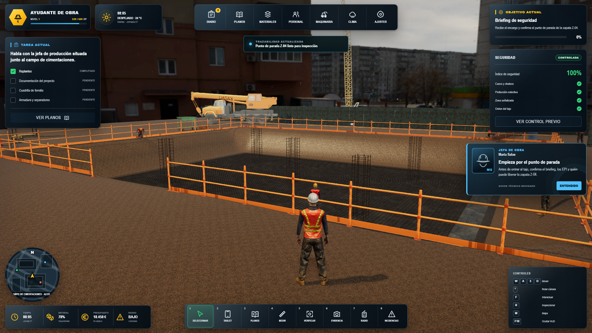
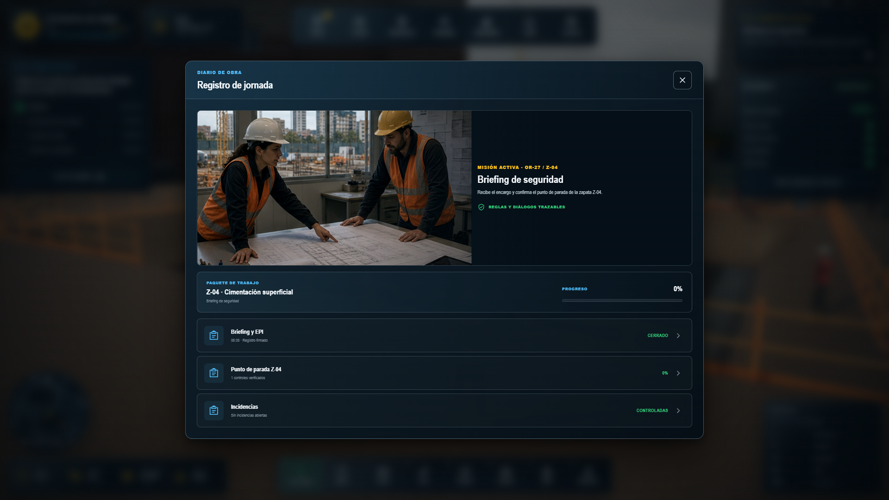
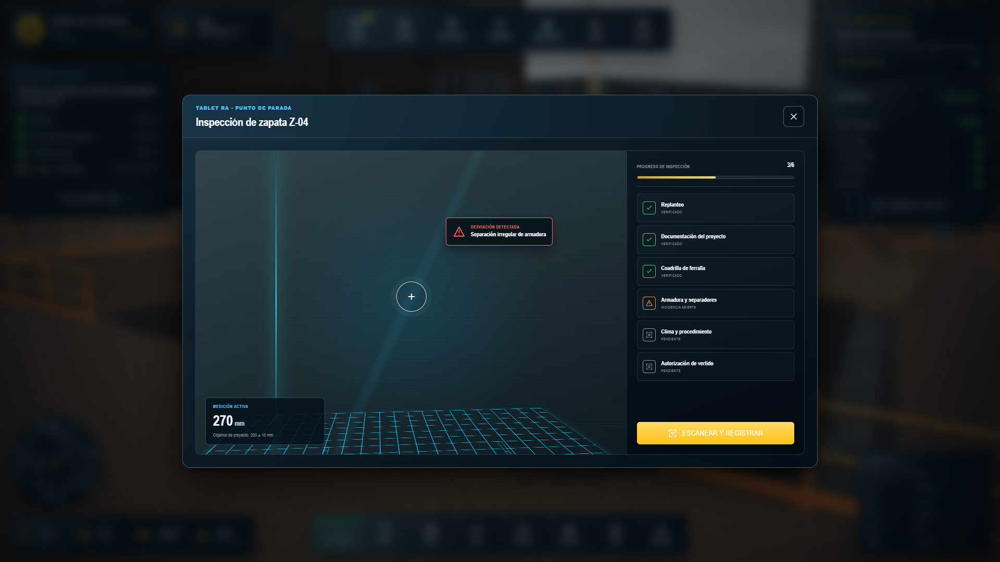

# Cimentaciones: Obra Real — edición web

Vertical slice jugable de alta fidelidad para navegador de escritorio. Recorre de principio a fin el punto de parada Z-04: briefing, documentación, cuadrilla, inspección RA, incidencia de ferralla, corrección, reinspección, clima, vertido, curado y dossier final.







## Iniciar el juego

Haz doble clic en `INICIAR_WEB.cmd`. El lanzador:

1. comprueba que Node.js esté instalado;
2. instala las dependencias solo si faltan;
3. inicia el servidor local en `http://127.0.0.1:5197/?autostart=1`;
4. abre el juego automáticamente en el navegador.

Para cerrarlo, vuelve a la ventana del servidor y pulsa `Ctrl+C`.

Inicio manual:

```powershell
npm install
npx vite --host 127.0.0.1 --port 5197 --strictPort --open "/?autostart=1"
```

## Controles

- `W A S D` o flechas: caminar.
- `Mayús`: correr.
- Arrastrar con el ratón: rotar cámara; rueda: zoom.
- `F` o `E`: interactuar.
- `R` o `T`: inspección con tablet.
- `M`: diario/mapa de misión.
- `G`: alternar condiciones meteorológicas.
- `F10`: ocultar o mostrar el HUD.
- `Esc`: cerrar el panel activo.

## Calidad visual y sistemas

- Three.js/WebGL2 con ACES, GTAO, bloom contenido, render target MSAA x4 y SMAA final.
- Entorno HDRI urbano de obra, sombras de contacto 4K, niebla atmosférica, polvo, lluvia, humedad y noche.
- Materiales PBR 4K para terreno, hormigón y acero; macrovariación de suelo y respuesta física a humedad.
- Excavación con taludes reales, hormigón de limpieza, losa ejecutada, ferralla corrugada, jaulas, defecto geométrico verificable, barandilla perimetral con rodapié y acopios detallados.
- Personaje y seis NPC 3D riggeados con animación, adaptación a la rasante y variantes de EPI; no se renderizan cápsulas ni primitivas de depuración.
- Maquinaria y utilería GLB con materiales físicos: dos grúas, vallado, generador, carros, estanterías, tuberías, sacos, barreras, herramientas y logística de obra.
- HUD profesional adaptable, ocultable y no dependiente solo del color; diario, planos, clima, personal, maquinaria, tablet RA y recursos.
- Seis imágenes cinematográficas originales 16:9 para las fases del diario, sin texto horneado.

## Supervisor reactivo

Los diálogos no usan generación abierta. Son ramas técnicas deterministas, versionadas y trazables. El supervisor interviene ante:

- entrada en zona de riesgo;
- EPI o acceso incorrecto;
- incidencia ignorada;
- intento de vertido sin liberación;
- lluvia y decisión meteorológica insegura;
- inactividad en cada fase;
- corrección, reinspección y cierre ejecutados correctamente.

La pantalla de clima incluye una decisión insegura intencionada para comprobar el bloqueo pedagógico: el jugador recibe una reprimenda contextual, pierde reputación simulada y debe reprogramar de forma segura.

## Recorrido completo

1. Briefing y EPI.
2. Revisión de C-101, GEO-02 y PC-01.
3. Asignación de la cuadrilla.
4. Escaneo RA de la cimentación.
5. Corrección de la separación no conforme.
6. Reinspección y liberación del punto de parada.
7. Reevaluación y reprogramación por clima.
8. Recepción, autorización y vertido del lote.
9. Curado y protección.
10. Cierre trazable del dossier de calidad.

El estado se guarda en `localStorage`. La losa, la ferralla, la incidencia, el clima, el HUD y los NPC se sincronizan con la fase cargada.

## Validación

```powershell
npm run build
npm run test:state
npm run test:ai
npm run test:phases
npm run test:acceptance
```

La aceptación automatizada recorre las diez fases en Edge, valida guardado/carga, locomoción, pies sobre rasante, colisiones, tecla `F`, RA, corrección física, cuatro climas, supervisor, cambio visual tras el vertido, HUD a 1920×1080 y 1366×768, y ausencia de errores de consola.

## Activos y límites de uso

El inventario de procedencia, hashes y licencias está en `public/assets/licenses/registry.json`. Las texturas de ambientCG y los activos de Poly Haven están documentados como CC0. El personaje, sus animaciones y las dos grúas proceden de archivos locales aportados al proyecto y conservan estado de licencia no verificada: esta compilación es adecuada para evaluación local, pero esos activos deben sustituirse o documentarse antes de una publicación comercial.

Esta experiencia es didáctica. Los datos pertenecen al proyecto ficticio OR-27 y no sustituyen proyecto, dirección facultativa, plan de seguridad ni formación habilitante.
